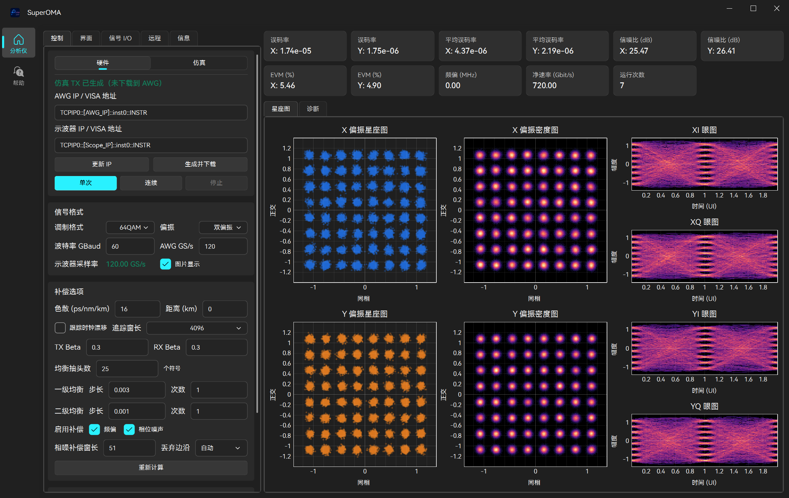
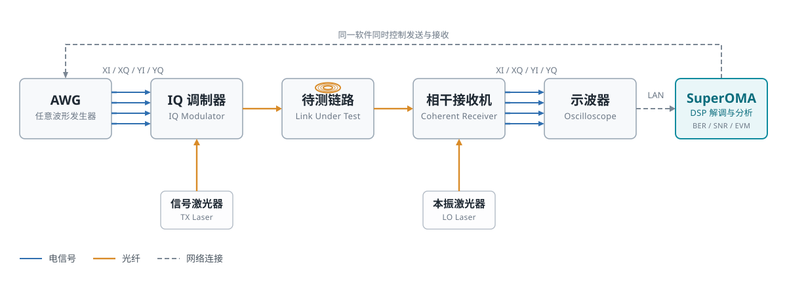
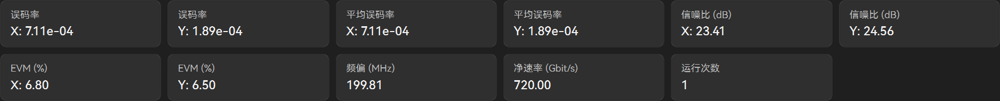
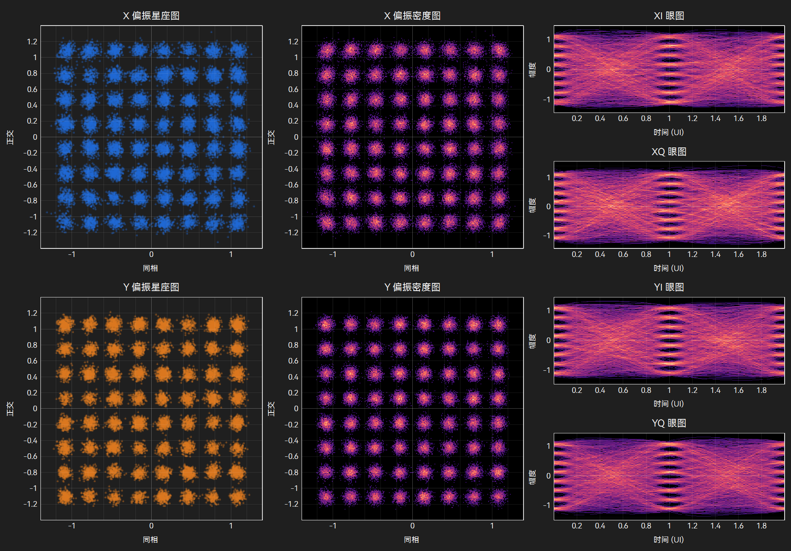
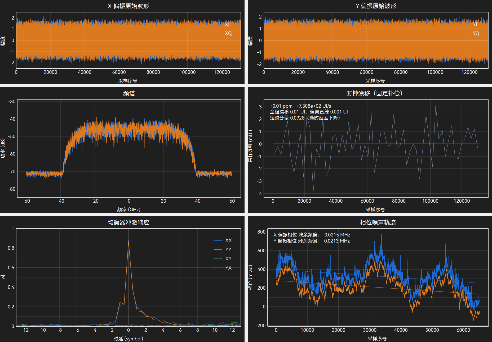
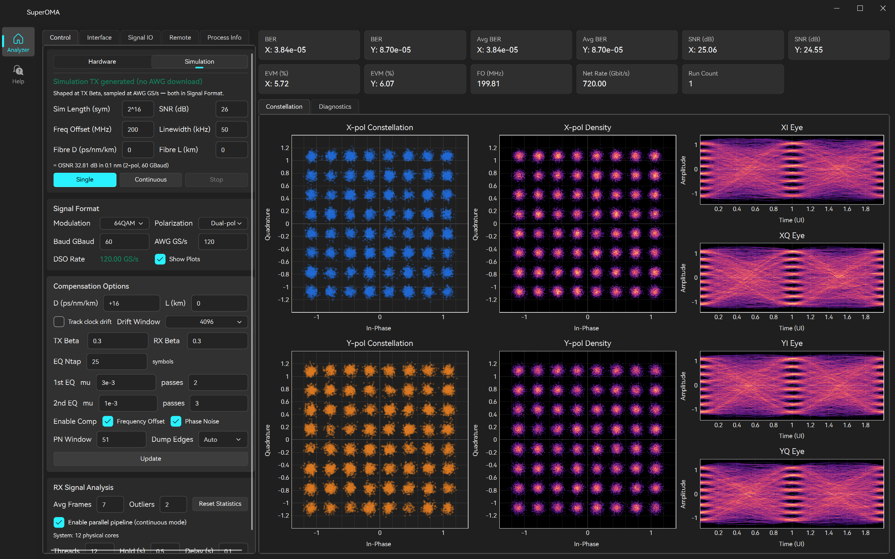

<div align="center">

# SuperOMA

### 相干光信号发生与分析软件

**从发送信号生成、仪器控制、数据采集、相干 DSP 解调到指标输出，一个软件跑通全流程。**<br>
不绑定专用硬件：用实验室现有的 AWG 和实时示波器，就能搭起一套完整的相干光测试系统。

[](../../releases/latest)


[**⬇ 下载最新版本**](../../releases/latest) · [核心亮点](#核心亮点) · [功能详解](#功能详解) · [规格速览](#规格速览) · [安装与授权](#安装与授权) · [快速上手](#快速上手) · [联系我们](#联系我们)

</div>

<br>



---

## 为什么选择 SuperOMA

OMA 即 Optical Modulation Analyzer（光调制分析仪）。商用 OMA 通常要和特定厂商的硬件一起买，解调算法也不公开。而用自己的仪器搭测试平台，又要在仪器软件、MATLAB 脚本和自研代码之间来回导数据：导出波形、写脚本对齐时钟、调试解调代码，链路每改一次，这套流程就要从头再走一遍。

**SuperOMA 用纯软件实现了 OMA 的全部功能。** 波形的生成与下载、采集的触发与读取、全部 DSP 处理，都在同一个界面里完成：

- **不用额外买硬件**：直接接入现有的 AWG、实时示波器和收发光路。
- **解调过程是透明的**：所有 DSP 参数都显示在界面上，都可以调。
- **数据完全开放**：原始波形可以导出为 `.mat`，用 MATLAB 或 Python 直接读取。

---

## 核心亮点

| | |
|:--|:--|
| 🔌 **不绑定专用硬件** | 直接使用现有的 AWG、实时示波器与收发光路。支持 **Keysight 是德 / Tektronix 泰克 / Teledyne LeCroy 力科 / LongSight 万里眼** 四个品牌的高速实时示波器，品牌自动识别 |
| ⚡ **高速并行 DSP** | 核心算法用 C++ 实现并多线程并行，采集与解调重叠进行，测量不停顿。200 k 点 16QAM 的测量速率可达 **1.5 帧/s**¹ |
| 🎛️ **全部参数可见、可调** | 解调参数集中在一张卡片上，按 DSP 施加顺序自上而下排列，界面布局就是处理流程 |
| 📊 **一屏看全链路** | 散点与密度星座图、四路眼图、频谱、时钟漂移、均衡器冲激响应、相位噪声轨迹、原始波形，性能下降的原因可以直接从图上定位 |
| 🤖 **SCPI 远程自动化** | 内置 SCPI over TCP 服务，可用 LabVIEW / Python / C++ / MATLAB 远程配置参数、触发测量、读取结果 |
| 🧪 **离线仿真** | 不接仪器也能运行完整的解调流程，信噪比、频偏、线宽、色散均可设定，适合演示、培训和算法预研 |
| 💾 **开放的数据格式** | 导出的 `.mat` 含原始接收波形与发送参考序列，可以随时按新参数重新解调，也可以交给自己的算法处理 |
| 📦 **单个 exe，复制即用** | 软件本体不需要安装程序，不依赖 MATLAB 与厂商 VISA 运行库；中英文界面、深浅色主题一键切换 |

<sub>¹ 仿真条件下测得，不含仪器通信与绘图时间；AMD Ryzen 9 3900X，12 线程。</sub>

---

## 系统构成

一次完整的测量由三部分组成：运行 SuperOMA 的计算机、发送端与接收端的仪器，以及两者之间的待测链路。**发送端和接收端由同一个软件控制。**



图中的任意波形发生器、示波器、IQ 调制器、相干接收机和激光器都可以使用现有设备。

---

## 功能详解

### 📡 信号发生与下载

- 按设定的调制格式与波特率生成发送符号，经**根升余弦成形**、重采样后直接下载到 AWG。
- 支持 **QPSK / 16QAM / 64QAM**，**双偏振与单偏振**；I/Q 与 AWG 物理通道的映射可以自由设置。
- 下载前自动校验波形长度，不满足 AWG 的点数约束时，**直接给出可用的邻近取值**。

### 🔧 仪器控制与数据采集

- 从示波器读取 **XI / XQ / YI / YQ** 四路波形送入解调。
- **示波器品牌根据仪器标识自动判断**，采样率在每次采集时自动读取，不需要手动填写。
- 通道映射**可键入至 Ch 32**，并**支持差分输入**（如 `Ch 2 - Ch 1`）；数据位宽可选 8 bit / 16 bit。
- Keysight M8198/M8199 系列的 **AWG 模块自动定位**；连接断开后会自动重建，不需要人工干预。
- 出错时给出具体说明而不是笼统的报错。例如采样率低于波特率时，提示中会列出实际读到的采样率和当前波特率。

### 🎚️ 发射机预补偿与频谱预加重

- **arcsin 非线性预补偿**：抵消马赫-曾德尔调制器的正弦传输特性，调制深度与削波强度可调，可随时开关做前后对比。
- **频谱预加重**：按信道响应补偿发送信号，**收发两端的损伤分担比例可以设定**。

### 🧮 相干解调：全部参数可见、可调

接收信号按固定顺序处理，界面上的参数卡片也按同样的顺序排列：

| # | 处理环节 | 作用 | 可关闭 |
|:-:|---|---|:-:|
| 1 | I/Q 正交化与归一化 | 校正 I、Q 两路之间的正交误差与幅度失配 | |
| 2 | 色散补偿 | 按色散系数与光纤长度施加反向传输函数 | |
| 3 | 定时恢复 | 估计并校正采样相位，**可逐段跟踪时钟漂移** | |
| 4 | 匹配滤波 | 根升余弦匹配滤波，滚降系数与发送端分开设置 | |
| 5 | 第一级均衡 | 恒模盲均衡，工作在 2 采样/符号，快速预收敛并完成**偏振解复用** | |
| 6 | 第二级均衡 | 判决引导均衡，工作在符号速率，进一步降低 EVM | ✅ |
| 7 | 频偏补偿 | 估计并补偿载波与本振之间的频率偏移 | ✅ |
| 8 | 相位噪声补偿 | 盲相位搜索，在均衡器前后各执行一遍，估计窗口可调 | ✅ |
| 9 | 边缘符号丢弃 | 丢弃首尾未收敛的符号，**丢弃量可自动计算** | |

几处方便使用的设计：

- **均衡跨度按符号数设定**，软件自动换算两级均衡器各自的抽头数，两级覆盖相同的时间长度。
- **时钟漂移跟踪可以开关**：共用参考时钟时施加一个固定修正即可，独立时钟时沿记录逐段跟踪，勾选一个选项就能切换。
- **双偏振参考序列自动匹配**：用互相关找出每一路输出对应的发送序列，不需要人工指定。

### 📈 测量指标与统计



- 每帧给出 **BER、SNR、EVM、载波频偏与净速率**，X / Y 偏振分开显示。
- **离群帧剔除**：在最近 N 帧中去掉误码率最差的几帧，用剩下的 M 帧求平均（默认 N = 7、M = 5）。统计口径显示在界面上，写测量报告时可以直接引用。
- 支持**单发单收、双发双收、单发双收（伪双偏振）、双发单收**四种收发组合。

### 🔍 图形显示与诊断



**星座图**有散点和密度两种，并排显示；**眼图**同时给出四路，可选密度伪彩或线条叠加。配色表、映射区间（按百分位）、伽马曲线、直方图分辨率、绘制点数都可以调，**这些设置只影响显示，改完重绘当前帧即可，不需要重新采集**。



| 诊断图形 | 用来判断什么 |
|---|---|
| **原始采集波形** | 削顶、直流偏置、偏振间电平失配、采集中断。结果异常时应当首先查看这张图 |
| **频谱** | 信号带宽是否被 DAC、调制器或示波器截断；点击图上任意位置即标出该点的频率与幅度 |
| **时钟漂移** | 收发仪器是否共用参考时钟；图中直接标出时钟频差（ppm）与每秒符号滑移量 |
| **均衡器冲激响应** | 均衡跨度是否足够；双偏振时直通与交叉四条曲线分别画出，可以看出偏振旋转的程度 |
| **相位噪声轨迹** | 峰峰值就是相位噪声的幅度，拟合斜率可折算出残余频偏 |

每张图形都可以单独关闭，**关闭后对应的计算也一并跳过**。连续测量需要提高刷新率时，可以用这种方式减轻负担。

### ⚡ 并行流水线


连续测量时，一帧采集完成后立即转入后台解调，同时开始采集下一帧，直到所有线程都处于工作状态。状态条用颜色实时显示每个并行通道正在做什么（空闲 / 采集中 / DSP / 就绪 / 显示中 / 错误），线程数上限为本机的物理核心数。

### 🧪 离线仿真

- 由发送序列合成接收波形，**解调流程与实测完全相同**。
- **信噪比、载波频偏、激光器线宽、光纤色散**均可设定，同时给出换算后的 **OSNR（0.1 nm 参考带宽）**。
- 在线与离线共用同一张卡片，顶部开关一键切换，**离线结果可以和实测结果直接对照**。

### 💾 数据导入与导出

- 导出的 `.mat` 文件包含**原始接收波形**与**发送参考序列**，MATLAB / Python 可以直接读取。
- 文件可以载回软件，**按新参数重新解调**；存档中保存的是原始波形，与解调参数无关，历史数据随时可以重新计算。
- **`重新计算`**：用当前参数对屏幕上的这一帧重新解调，不重新采集，所以前后指标的差异完全来自参数的改变。
- **解调失败的帧也会保留原始波形**，改好参数后直接重算，不需要重新采集。

### 🤖 远程控制与自动化

内置 **SCPI over TCP** 服务（在「远程」页启用，默认端口 5555），可以远程完成参数配置、单次/连续采集、生成并下载、读取指标、上传或下载波形、离线参数扫描。任何能打开 TCP socket 的语言都能调用：

```python
import pyvisa

rm  = pyvisa.ResourceManager()
oma = rm.open_resource("TCPIP0::192.168.0.10::5555::SOCKET",
                       read_termination="\n", write_termination="\n",
                       timeout=600_000)

print(oma.query("*IDN?"))
oma.write(":SIGNal:FORMat QAM16")
oma.write(":SIGNal:BAUDrate 20e9")
oma.write(":DSP:EQ:NTAPs 25")

oma.write(":SOURce:GENerate")      # 生成发送信号并下载到 AWG
oma.query("*OPC?")
oma.write(":INIT")                 # 单次采集并解调
oma.query("*OPC?")                 # 等待完成
print("BER X/Y:", oma.query(":FETC:BER:X?;:FETC:BER:Y?"))
print("SNR X/Y:", oma.query(":FETC:SNR:X?;:FETC:SNR:Y?"))
```

完整的指令手册（含 MATLAB / Python 示例程序）内置于软件的帮助页中。

### 🖥️ 界面与部署



- **中英文界面、深浅色主题**一键切换。
- **单个 exe 复制即用**：软件本体不需要安装程序，**不依赖 MATLAB 和厂商 VISA 运行库**（授权方式见[安装与授权](#安装与授权)）。
- 所有设置自动保存在 exe 同目录下的 `app_config.json`，**更换实验配置只需替换这个文件**。
- 使用说明与 SCPI 编程手册**内置于软件**，带可跟随正文滚动的目录。

---

## 支持仪器

| 类别 | 支持范围 |
|---|---|
| **实时示波器** | Keysight 是德 / Tektronix 泰克 / Teledyne LeCroy 力科 / LongSight 万里眼（自动识别品牌） |
| **任意波形发生器** | Keysight M8190A / M8194A / M8195A / M8196A / M8198A / M8199A / M8199B |
| **通道映射** | AWG 四通道或两通道；示波器可键入至 Ch 32，支持差分输入 |
| **数据位宽** | 8 bit / 16 bit |
| **仪器接口** | LAN，标准 VISA 地址（只填 IP 时自动补全） |

---

## 规格速览

| 项目 | 规格 |
|---|---|
| 调制格式 | QPSK、16QAM、64QAM |
| 偏振模式 | 双偏振、仅 X 偏振、仅 Y 偏振 |
| 收发路数组合 | 单发单收、双发双收、单发双收（伪双偏振）、双发单收 |
| 脉冲成形 | 根升余弦，滚降系数 0～1，收发分开设置 |
| 发射机预补偿 | arcsin 非线性预补偿与削波；频谱预加重，收发损伤分担比例可设定 |
| 色散补偿 | 按色散系数与光纤长度补偿 |
| 定时恢复 | 固定补偿，或沿记录跟踪时钟漂移（跟踪窗口 1024～65536） |
| 自适应均衡 | 恒模盲均衡 + 判决引导均衡两级级联；跨度、步长、训练遍数分别可调 |
| 载波恢复 | 频偏估计与补偿、盲相位搜索，均可单独关闭 |
| 测量指标 | BER、平均 BER、SNR、EVM、载波频偏、残余频偏、时钟频差、净速率 |
| 统计方式 | 最近 N 帧中取最好的 M 帧求平均，N、M 可设 |
| 图形输出 | 散点星座、密度星座、四路眼图、频谱、时钟漂移、均衡器冲激响应、相位噪声轨迹、原始波形 |
| 并行处理 | 核心 DSP 由 C++ 实现，多线程流水线，线程数上限为本机物理核心数 |
| 离线仿真 | 可设定信噪比、载波频偏、激光器线宽、光纤色散，并给出 OSNR 换算值 |
| 远程控制 | SCPI over TCP，端口与监听地址可设定 |
| 数据格式 | `.mat`，含原始接收波形与发送参考序列 |

---

## 安装与授权

SuperOMA 发行版经过 **Virbox 加密保护**，首次运行前需要完成授权。下面两种方式任选其一：

| 授权方式 | 需要准备 | 适用场景 |
|---|---|---|
| **优盾授权** | Virbox 用户工具 + 优盾（USB 加密锁） | 正式使用 |
| **试用序列号** | Virbox 用户工具 + 试用序列号 | 试用评估 |

**操作步骤：**

1. **安装 Virbox 用户工具**：在 [Releases](../../releases/latest) 页面下载 `sense_shield_installer_*.exe` 并安装。也可以到 [Virbox 下载中心](https://lm.virbox.com/tools.html) 下载 Windows 版的"Virbox 用户工具"。
2. **完成授权**：
   - **优盾用户**：把优盾插到电脑的 USB 口上。
   - **试用用户**：打开 Virbox 用户工具，输入试用序列号完成激活。试用序列号请[联系我们](#联系我们)获取。
3. 双击运行 `SuperOMA.exe`。

---

## 快速上手

1. 在 [Releases](../../releases/latest) 页面下载 `SuperOMA.exe`，放到任意目录，按[安装与授权](#安装与授权)完成授权后双击运行。
2. 填写 **AWG** 与**示波器**的 IP 地址，点击 **`更新 IP`**，弹窗显示两台仪器的型号即表示连接成功。
3. 设置**调制格式**与**波特率**，其余参数保持默认即可。
4. 点击 **`生成并下载`**，发送信号会被下载到 AWG。
5. 点击 **`单次`** 采集一帧并解调，读取 BER / SNR / EVM 与星座图。
6. 需要长时间观测时点击 **`连续`**，并行流水线会自动接管。

> 💡 暂时没有仪器？把控制页顶部的「硬件 / 仿真」开关切到 **`仿真`**，就能体验完整的解调流程。

---

## 运行环境

| 项目 | 要求 |
|---|---|
| 操作系统 | Microsoft Windows（64 位） |
| 处理器 | 四核或以上（并行线程数上限取决于物理核心数） |
| 内存 | 8 GB 或以上 |
| 界面语言 | 中文 / English |
| 安装 | 软件本体为单个 exe，不需要安装；不依赖 MATLAB 与厂商 VISA |
| 授权 | 安装 Virbox 用户工具，并使用优盾或试用序列号 |
| 网络 | 计算机与仪器处于同一网段，能互相 ping 通即可 |

> 首次运行时如果弹出 Windows SmartScreen 提示，点击「更多信息 → 仍要运行」即可。开启 SCPI 远程服务并监听非本机地址时，请在 Windows 防火墙弹窗中选择允许。

---

## 常见问题

<details>
<summary><b>打开软件时提示没有授权，怎么办？</b></summary>

请依次检查：Virbox 用户工具是否已经安装；使用优盾时，优盾是否已插好；使用试用序列号时，是否已在 Virbox 用户工具中激活且仍在有效期内。仍无法解决时请[联系我们](#联系我们)。
</details>

<details>
<summary><b>能否只购买软件，配合现有的仪器使用？</b></summary>

可以，这正是 SuperOMA 的设计目标。软件不绑定任何硬件，仪器在支持列表内即可接入。
</details>

<details>
<summary><b>我的示波器不在支持列表里，可以用吗？</b></summary>

目前不能直接使用。各品牌的波形读取指令与数据格式差别较大，采集后端是按品牌分别实现的。采集后端是独立模块，新增品牌支持的工作量比较明确，欢迎联系我们评估。
</details>

<details>
<summary><b>是否支持 256QAM 或概率整形？</b></summary>

当前版本支持 QPSK、16QAM、64QAM，暂不支持 256QAM 与概率整形。如有需要可以联系我们定制。
</details>

<details>
<summary><b>测量数据能导入 MATLAB 自行分析吗？</b></summary>

可以。导出的 `.mat` 文件包含原始接收波形与发送参考序列，MATLAB 和 Python 都能直接读取，可以完全按自己的算法重新处理。
</details>

<details>
<summary><b>软件是实时处理的吗？</b></summary>

不是。软件按帧工作：采集一段记录，完整解调后给出结果。连续模式下通过并行流水线提高刷新率。
</details>

---

## 定制开发

SuperOMA 采用模块化设计，可以根据具体需求做定制修改，包括但不限于**界面、DSP 流程、仪器支持与测量指标**。欢迎联系我们评估。

## 联系我们

| 销售与售后服务 | |
|---|---|
| 联系人 | 陈先生（销售 / 技术支持） |
| 邮箱 | [superoma@163.com](mailto:superoma@163.com) |

---

<div align="center">
<sub>© 2026 SuperOMA. All rights reserved.</sub>
</div>
